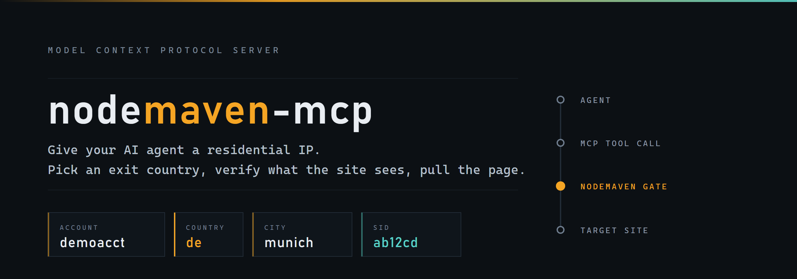
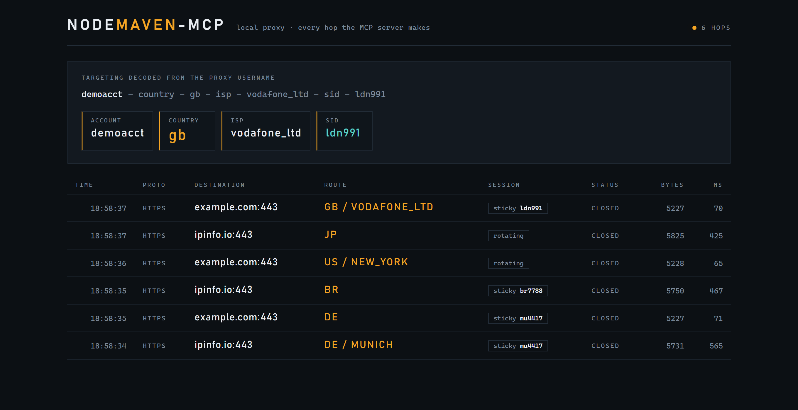

# nodemaven-mcp

[](https://github.com/Artirain/nodemaven-mcp/actions/workflows/ci.yml)
[](https://www.python.org/downloads/)
[](LICENSE)

[English](README.md) | **Русский**

**Резидентный IP для вашего AI-агента.** [MCP](https://modelcontextprotocol.io)-сервер,
который позволяет Claude Code, Claude Desktop, Cursor и любому другому MCP-клиенту
ходить в веб через резидентные и мобильные прокси [NodeMaven](https://nodemaven.com):
выбрать страну выхода, проверить, что видит целевой сайт, и забрать страницу.

```
вы:     прочитай эту страницу товара так, как её видит покупатель в Мюнхене
агент:  nodemaven_fetch(url=..., country="de", city="munich")
        -> 200, de, 14.99 EUR, exit IP 91.34.x.x (Vodafone), 812 ms
```

Неофициальный проект сообщества, лицензия MIT. С NodeMaven не аффилирован.

---

## Зачем

Всё чаще по сайтам ходит именно агент, и он упирается в ту же стену, что и все
остальные: IP дата-центров блокируют, а цены, наличие и выдача меняются от
географии. Прокси эту задачу решает давно - просто до него нельзя дотянуться
изнутри сессии агента.

Сервер закрывает разрыв пятью инструментами. Никакого DSL для скрапинга: агент
просит страну, получает рабочее соединение и читает страницу.

## Инструменты

| Инструмент | Что делает | Нужно |
|---|---|---|
| `nodemaven_build_proxy_url` | Собирает прокси-URL с геотаргетингом в username - готово для curl, Playwright, Scrapy, requests | креды прокси |
| `nodemaven_check_proxy` | Один запрос через прокси: exit IP, гео, ISP, задержка | креды прокси |
| `nodemaven_fetch` | Тянет URL через прокси, HTML превращает в читаемый текст | креды прокси |
| `nodemaven_list_locations` | Страны, регионы, города, ISP, индексы, доступные для таргетинга | API-ключ |
| `nodemaven_get_usage` | Расход трафика, число запросов, разбивка по доменам | API-ключ |

У каждого инструмента есть `response_format`: `markdown` (по умолчанию, компактно)
или `json` (полные данные для программной обработки), и пагинация через
`limit` / `offset`.

## Установка

```bash
git clone https://github.com/Artirain/nodemaven-mcp
cd nodemaven-mcp
pip install -e .
```

Нужен Python 3.10+.

## Настройка

Два независимых набора доступов, оба из [дашборда NodeMaven](https://dashboard.nodemaven.com):

- `NODEMAVEN_API_KEY` - Profile -> API Key. Используют инструменты локаций и статистики.
- `NODEMAVEN_PROXY_USERNAME` / `NODEMAVEN_PROXY_PASSWORD` - Proxy Setup. Нужны всему,
  что реально гонит трафик через прокси.

Можно задать только один набор: инструменты, которым не хватает второго, скажут
об этом прямым текстом, а не упадут молча.

### Claude Code

```bash
claude mcp add nodemaven \
  -e NODEMAVEN_API_KEY=... \
  -e NODEMAVEN_PROXY_USERNAME=... \
  -e NODEMAVEN_PROXY_PASSWORD=... \
  -- python -m nodemaven_mcp
```

### Claude Desktop / Cursor

`claude_desktop_config.json` (или `.cursor/mcp.json`):

```json
{
  "mcpServers": {
    "nodemaven": {
      "command": "python",
      "args": ["-m", "nodemaven_mcp"],
      "env": {
        "NODEMAVEN_API_KEY": "your-api-key",
        "NODEMAVEN_PROXY_USERNAME": "your-proxy-username",
        "NODEMAVEN_PROXY_PASSWORD": "your-proxy-password"
      }
    }
  }
}
```

Локальный `.env` в рабочей директории тоже подхватится - см. `.env.example`.
Переменные окружения всегда важнее файла.

**На Windows** указывайте абсолютный путь к `python.exe`, а не просто `python`.
Если Python поставлен из Microsoft Store, то `python` в PATH - это app execution
alias, который MCP-клиенты запустить не могут, и сервер молча не появляется в
списке. Нужный путь печатает `python -c "import sys; print(sys.executable)"`.

## Как пользоваться

Три вещи, которые стоит попросить у агента после подключения:

**Проверить, что видит сайт**

> «Я правда выхожу из Германии? Если можно, возьми IP Vodafone.»

Агент вызовет `nodemaven_check_proxy(country="de", isp="vodafone")` и вернёт exit IP,
город и задержку. Удобно как быстрый прогон перед длинной задачей.

**Прочитать гео-ограниченный контент**

> «Забери эту страницу как покупатель из Нью-Йорка и скажи цену.»

`nodemaven_fetch(url=..., country="us", city="new york")` вернёт читаемый текст,
по умолчанию обрезанный до 200 КБ, чтобы не забить контекст.

**Удержать одну личность на весь сценарий**

> «Залогинься в демо-аккаунт и пройди оформление заказа - всё время с одного IP.»

Передавайте один и тот же `session_id` (4-10 буквенно-цифровых символов), и
NodeMaven закрепит exit IP; уберёте его - IP будет меняться на каждом запросе.

Написание локаций важно. `nodemaven_list_locations(level="cities", country="de")`
отдаёт точные значения, которые принимает NodeMaven, - именно это отличает рабочий
пул от пустого.

## Посмотреть, что происходит на самом деле

Вызову инструмента легко поверить и трудно его проверить. `examples/traffic_dashboard.py`
поднимает локальный прокси с живой панелью: направьте сервер на него и смотрите
каждый сетевой хоп.

```bash
python examples/traffic_dashboard.py     # прокси на :8080, панель на :8099
```

```bash
NODEMAVEN_PROXY_HOST=127.0.0.1
NODEMAVEN_HTTP_PORT=8080
```



Каждая строка - реальный сетевой запрос. Колонка **route** расшифрована из
username прокси, то есть именно из той строки, по которой NodeMaven выбирает
exit IP. Так видно, что `country="de", city="Munich"` в вызове инструмента
действительно ушли с машины как `DE / MUNICH`, а `session_id` держал один и тот
же IP между вызовами.

Панель - инструмент для разработки: она принимает любые доступы и ничего не
шифрует. Не выставляйте её в общую сеть.

## Решения в дизайне

**Пароль по умолчанию скрыт.** `build_proxy_url` подставляет `***` вместо пароля,
пока вызывающий явно не передаст `reveal_credentials=true`. Логи разговоров
пересылают, вставляют в issue и скармливают моделям обратно; пароль от прокси не
должен ехать вместе с ними по умолчанию.

**Ошибки написаны для агента, а не для лог-файла.** На отказ соединения сервер
отвечает, что обычная причина - слишком узкий фильтр по городу или ISP, и
предлагает его расширить. На 401 - называет переменную окружения, которую надо
проверить. Агент, который может прочитать ошибку, повторит запрос правильно с
первого раза.

**Логика таргетинга чистая и покрыта тестами.** NodeMaven кодирует локацию прямо в
username прокси:

```
acct-country-us-region-california-city-los_angeles-isp-t_mobile_usa-sid-ab12cd-filter-medium
```

Сборка этой строки - нормализация `"Los Angeles"` в `los_angeles`, отказ от
session id, который молча сломал бы sticky-сессию, проверка порта по диапазону
для выбранного протокола - чистая логика, поэтому она покрыта тестами, которые
вообще не ходят в сеть.

**Без парсерных зависимостей.** HTML в текст превращает `html.parser` из
стандартной библиотеки. Всего зависимостей три: `mcp`, `httpx`, `pydantic`.

## Разработка

```bash
pip install -e ".[dev]"
pytest -q          # 60 тестов, без сети и без доступов
ruff check .
```

CI гоняет тесты на Python 3.10, 3.11 и 3.12.

Контрибьюты приветствуются - см. [CONTRIBUTING.md](CONTRIBUTING.md).

## Лицензия

MIT
